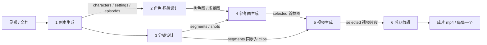

# VideoClaw 工作流详解：从灵感到成片

> 本文档详细描述主流程（六阶段工作流）的完整链路：输入 → 剧本 → 角色/场景设计 → 分镜 → 参考图 → 视频片段 → 成片，以及每一阶段的处理流程、产物结构、用户介入点与失败兜底机制。
>
> 相关文档：`SKILL.md`（Agent 协作规则）、`references/workflow/*.md`（各阶段 API 操作手册）。

---

## 1. 总览

### 1.1 一句话流程

用户给一个"想法"（可选带文档素材、风格、画幅、模型选择）→ 系统自动完成六个阶段 → 产出按集拼接好的 mp4 成片；**每个阶段结束都会停下来等待用户确认**，且任意阶段都支持修改、重生成、跳过或上传自定义素材。

### 1.2 六阶段与数据流



- **第 3 阶段的产物会自动"投影"为第 4 阶段的 `scenes`（参考图条目）与第 5 阶段的 `clips`（视频片段条目）**——修改分镜后，下游条目同步更新，已完成的内容保留。
- 每一阶段的产物（artifact）都保存为结构化 JSON（含每个条目的版本列表与当前选中项），既驱动下一阶段，也用于前端展示与用户介入。

### 1.3 关键概念

| 概念 | 说明 |
| --- | --- |
| **Session（会话）** | 一次完整创作的状态载体，`session_id` 为毫秒时间戳；持久化于 `data/code/data/sessions/<session_id>.json`（包含 `meta` + `artifacts` + `status`） |
| **Artifact（阶段产物）** | `artifacts[stage]` 结构化数据，如 `characters/settings`、`episodes`、`scenes`、`clips`、`final_videos`；条目统一带 `selected`（当前选用版本）、`versions`（历史版本）、`status` |
| **Stage 状态** | `pending`（无产物）→ `running`（执行中）→ `waiting`（有产物待用户介入）→ `completed`（确认完成）；另含 `stopped` / `error` |
| **停点（确认制）** | 每个阶段执行结束即进入 `waiting`，必须由用户确认（`POST /api/project/{sid}/continue`）才进入下一阶段；这是保证可控创作的核心机制 |
| **SSE 流式反馈** | `POST /api/project/{sid}/execute/{stage}` 与 `/intervene` 均返回 `text/event-stream`：`progress`（含逐条目完成事件）、`stage_complete`、`error`、`heartbeat` |
| **介入（Intervention）** | 阶段完成后通过 `/intervene` 携带 `modifications` 执行"部分重做"（指定条目重生成、修改描述、换图等），无需整阶段重跑 |

### 1.4 模型体系（贯穿所有阶段）

| 能力 | 会话字段 | 典型用途 |
| --- | --- | --- |
| LLM 文本 | `llm_model` | 剧本/分镜生成、提示词重写（doctor）、首帧提示词 |
| VLM 视觉语言 | `vlm_model` | 生成结果评估（打分/硬性失败项）、多版本选优 |
| 文生图 t2i | `image_t2i_model` | 角色/场景图、无参考图时的参考图 |
| 图生图 i2i | `image_it2i_model` | 带参考图（角色/场景一致）的参考图生成 |
| 视频 | `video_first_frame_model` / `video_start_end_model` / `video_reference_model` | 首帧 / 首尾帧 / 参考图三种生视频模式（由 `video_generation_mode` 决定用哪个） |

- 模型来源：**内置注册表**（DashScope / ARK / OpenAI / Gemini / Kling 等）+ **自定义供应商与模型**（`api_providers` 新增供应商：`protocol` = `openai` / `vllm-omni` / `sglang`；`custom_models` 引用注册，覆盖 LLM/VLM/文生图/图生图/视频）。
- 注册方式三选一（等价）：设置页「自定义供应商/自定义模型」、直接编辑 `config.yaml`、`.env` 变量（`VC_PROVIDER_*` / `VC_MODEL_*` / `VC_CUSTOM_MODEL_*`，优先级最高）。
- 客户端路由为**注册表优先**：命中自定义模型走协议适配层，否则走内置名称路由；未注册的模型 id 会明确报错（不会误落入某供应商默认分支）。
- 每个模型有 `concurrency`（并发缺省 1，本地单卡服务最保守）；阶段内的批量生成按该值限流（会话里 `enable_concurrency=false` 时强制串行）。
- **模型可用性预检**：第 2/4 阶段执行前检查所用图像模型（未注册 / 供应商缺失或不完整 / 内置缺 Key）→ 直接返回 `409 model_unavailable`（附字段级原因），不触发任何生成；设置页提供逐类型的**连通性测试**（`POST /api/models/test`，支持未保存草稿，不持久化配置）。

---

## 2. 阶段 0：创建项目（输入）

**接口**：`POST /api/project/start`

```json
{
  "idea": "一个程序员离职后收购老东家的故事",
  "file_path": "1720392941_script.docx",
  "style": "anime",
  "video_ratio": "16:9",
  "video_resolution": "720P",
  "expand_idea": true,
  "episodes": 4,
  "llm_model": "qwen3.5-plus",
  "vlm_model": "qwen3.5-plus",
  "image_t2i_model": "doubao-seedream-5-0-260128",
  "image_it2i_model": "doubao-seedream-5-0-260128",
  "video_first_frame_model": "wan2.7-i2v",
  "video_start_end_model": "wan2.7-i2v",
  "video_reference_model": "wan2.7-r2v",
  "video_generation_mode": "first_frame",
  "enable_concurrency": true,
  "web_search": false
}
```

流程：

1. 若 `file_path` 存在，后端解析文档（.txt/.md/.pdf/.doc/.docx）并与 `idea` 拼接作为最终灵感（`POST /api/upload_file` 先上传得到路径）；
2. 校验必需模型字段（LLM/VLM/文生图/图生图 + 当前视频模式的模型）；
3. 创建会话，写入 `meta`：灵感、风格、画幅、分辨率、全部模型选择、是否开启并发/联网、集数等；
4. 之后各阶段通过 `POST /api/project/{sid}/execute/{stage}` 触发，全程可用 `GET /api/project/{sid}/status` 轮询状态。

**用户在此阶段可介入**：随时通过 `PATCH /api/project/{sid}/models` 调整会话级模型/画幅/分辨率；用顶栏「生成配置」面板即可操作。

---

## 3. 阶段 1：剧本生成（script_generation）

**执行**：`ScriptWriterAgent` ｜ **模型**：`llm_model`（+ 可选 `web_search`）

处理流程：

1. 解析灵感（`expand_idea=true` 时先做创意扩写），结合风格与集数，由 LLM 生成结构化剧本；
2. 流式产出剧集骨架与分幕内容（SSE `progress` 携带 `beat_sheet` / `act_complete` 等事件供前端实时展示）；
3. 落盘为阶段产物，阶段进入 `waiting`，等待用户确认。

**产物结构**（`artifacts.script_generation`）：

```json
{
  "characters": [
    {"character_id": "char_1", "name": "林澈", "description": "32 岁程序员…", "species": ""}
  ],
  "settings": [
    {"setting_id": "set_1", "name": "旧办公室", "description": "深夜的开放工位…"}
  ],
  "episodes": [
    {"episode_number": 1, "act_title": "第一集·离场",
     "segments": [
       {"segment_id": "seg_01_01",
        "shots": [{"shot_id": "shot_01", "content": "镜头内容", "plot": "剧情", "duration": 5}]}
     ]}
  ]
}
```

**用户可介入**：

- 修改剧本文本/角色/场景/分集（`PATCH /api/project/{sid}/artifact/script_generation`，支持新增空白角色/场景/剧集）；
- **智能续写**：给出续写方向 → 后端只回预演（`new_episodes` 预览，不污染下游）→ 用户确认后才写入并与下游同步；
- 确认（`/continue`）后进入第 2、3 阶段。

---

## 4. 阶段 2：角色/场景设计（character_design）

**执行**：`CharacterDesignerAgent` ｜ **模型**：`image_t2i_model` 生成，`vlm_model` 评估，`llm_model` 供 doctor 重写提示词

处理流程：

1. **模型可用性预检**（新增）：不可用 → `409 model_unavailable`（不启动生成）；
2. **条目种子化**（新增）：若尚无产物条目，先把剧本中的角色/场景落为待生成条目（`pending`、可逐条上传），保证任何情况下都有上传落点；
3. 逐条目并发生成角色设计图 / 场景背景图（并发 = 模型 `concurrency`，缺省 1）；
4. 每条目做 **VLM 评估**（评分/硬性失败项）：不合格时把评估反馈注入提示词，最多重试 3 轮；仍不合格则调 VLM 在多个版本中选最佳；
5. 失败的条目带 `status: failed`；若是模型级错误（鉴权/模型不存在/连接失败等）会额外标注 `error_type: "model_unavailable"`；
6. 阶段进入 `waiting`。

**产物结构**：条目形如

```json
{"id": "char_1", "name": "林澈", "description": "…", "selected": "code/result/image/<sid>/Assets/characters/char_1.png",
 "versions": ["…v1.png", "…v2.png"], "status": "done"}
```

（`settings` 同理；图片落盘于 `data/code/result/image/<sid>/Assets/{characters,settings}/`）

**用户可介入**：

- 逐条目**上传自有图片**：`POST /api/project/{sid}/artifact/character_design/upload_image`（`item_type=characters|settings`）→ 追加版本并设为 `selected`，阶段状态自动重算（全部条目有 `selected` 即 `completed`）；
- 选择版本、修改名称/描述、单条目或批量重生成（`/intervene` → `regenerate_characters` / `regenerate_settings` / `update_descriptions`）；
- **模型不可用兜底（新增）**：预检失败时前端弹出引导弹窗（含原因）→「上传图片 / 更换模型 / 重试」三选一。

---

## 5. 阶段 3：分镜设计（storyboard）

**执行**：`StoryboardAgent` ｜ **模型**：`llm_model`

处理流程：

1. 按集将剧本拆为若干**片段（segment）**，每段包含若干**镜头（shot）**：给出 `plot`（剧情）、`visual_prompt`（画面提示词）、时长等；
2. 流式逐场上报（`scene_shots_complete`），前端实时渲染；
3. **跨阶段同步（关键）**：分镜完成后，每个 segment 自动同步为
   - 第 4 阶段的 `scenes` 条目（参考图待生成，字段含 `description=visual_prompt`）；
   - 第 5 阶段的 `clips` 条目（视频待生成，字段含 `description=plot 汇总`、`duration`、`episode`）；
4. 阶段进入 `waiting`。

**产物结构**：

```json
{"episodes": [
  {"episode_number": 1, "act_title": "…",
   "segments": [
     {"segment_id": "seg_01_01", "total_duration": 10,
      "shots": [{"shot_id": "shot_01", "content": "…", "plot": "…", "visual_prompt": "…", "duration": 5}]}
   ]}
]}
```

**用户可介入**：直接编辑分镜（`PATCH artifact/storyboard`，含 `episodes/segments/shots`）；保存后自动同步更新第 4/5 阶段的未生成条目（已生成/已上传的条目保留）。

---

## 6. 阶段 4：参考图生成（reference_generation）

**执行**：`ReferenceGeneratorAgent` ｜ **模型**：有参考图时用 `image_it2i_model`，否则 `image_t2i_model`；`vlm_model` 评估；`llm_model` 生成首帧提示词

处理流程：

1. **模型可用性预检**（同第 2 阶段，覆盖 t2i 与 i2i 两个字段）；
2. 从分镜 segments 构建任务，为每个片段收集参考图（该段涉及的角色图/场景图，`selected` 版本）；
3. 由 LLM 为每个片段生成首帧画面提示词（失败时回退用剧情文本）；
4. 生成参考图（多版本，默认最多 3 版）：VLM 评估打分/硬性失败项 → 不合格带反馈重试 → 仍不合格时 VLM 在多版本中选最佳（低分但有候选图时保留供人工确认）；
5. 完全无产出的片段标记 `failed`（模型级错误带 `error_type`）；阶段进入 `waiting`。

**产物结构**（`scenes`）：`{"id": "seg_01_01", "name", "index", "description", "visual_prompt", "selected", "versions", "status", "episode"}`；图片落盘于 `data/code/result/image/<sid>/Scenes/`。

**用户可介入**：

- 逐条目**上传自有参考图**（`upload_image`，`item_type=scenes`）——不依赖模型生成；
- 选择版本、编辑描述、单片段重生成（`/intervene` → `regenerate_scenes`）；
- 模型不可用兜底弹窗（同第 2 阶段）；
- 确认后，`selected` 参考图即作为**第 5 阶段的首帧输入**。

---

## 7. 阶段 5：视频生成（video_generation）

**执行**：`VideoDirectorAgent` ｜ **模型**：按 `video_generation_mode` 取 `video_first_frame_model` / `video_start_end_model` / `video_reference_model`

三种生成模式（会话级切换）：

| 模式 | 能力标签 | 输入 → 输出 |
| --- | --- | --- |
| 首帧生视频 `first_frame` | `first_frame_i2v` | 第 4 阶段 `selected` 图作为首帧 → 动态视频 |
| 首尾帧生视频 `start_end_frame` | `start_end_frame_i2v` | 首帧/尾帧两张图 → 中间过渡视频 |
| 参考图生视频 `reference` | `reference_to_video` | 多张参考图（角色/场景）→ 角色一致、含数字人口播等高级能力（支持原生音频/多镜头） |

处理流程：

1. 读取本阶段 `clips` 条目（描述/时长/所属集）与第 4 阶段 `selected_images`（自动注入）；
2. 为每个片段组装提示词：风格控制 + 人物列表（角色描述）+ 分镜段落（剧情/动作），并附加"不要生成字幕或水印"；
3. 按条目并发（= 模型 `concurrency`）调用视频模型生成片段，落盘 `data/code/result/video/<sid>/<segment_id>[_vN].mp4`；
4. 每个条目追加版本并设 `selected`；阶段进入 `waiting`。

**自定义模型在这阶段的约定**（vllm-omni / sglang / OpenAI 标准）：

- 支持四种能力：`text_to_video`（文生视频）、`first_frame_i2v`（首帧）、`start_end_frame_i2v`（首尾帧）、`reference_to_video`（参考图）；另含媒体参考扩展能力标签 `audio_reference`（音频参考）与 `video_reference`（参考视频，仅 vllm-omni 协议支持），未声明对应能力的模型不出现在相应选择入口；
- MiniMax-H3 任务自动推断并携带：纯文本 `t2va`、含首帧/首尾帧 `fl2va`、含参考图 `ref2va`；vllm-omni 以 `extra_params`（task/duration/frame_indices）为首选形态、失败自动回退旧形态；sglang 以 `task` 字段为必填；
- 多图字段：vllm-omni 多图用 `input_references` 重复（首尾帧附 `frame_indices=[0, -1]`）；sglang 顺序多图用同名 `input_reference` 重复；均保留命名回退候选（`last_frame` / `reference_images` / `image[]` 等）；含图的创建仅走 multipart（避免退化为“无图生成”）；
- **音视频参考**（vllm-omni / MiniMax-H3 ref2va）：音频参考以 `audio_reference={"audio_url": <HTTP(S) 或 data: URL>}` 表单字段携带（本地文件先转为服务端可访问 URL；跨机部署需保证该 URL 可被推理服务访问，否则改填 `data:` URL）；视频参考与图片参考按传入顺序合并进 `input_references` 重复上传（MIME 按文件类型推断：`video/mp4`、`video/quicktime`、`video/webm` 等）；媒体参考提交失败时按既有回退序列处理，最终失败错误包含服务端响应与目标地址，**绝不静默退化为无参考请求**；sync（`/v1/videos/sync`）与异步三段式两条链路行为一致；
- 采用三段式异步任务：创建（multipart 主形态，含文件时必用）→ 轮询任务状态（`GET /v1/videos/{id}`，失败回退列表）→ 下载内容写入 `save_path`；
- 与内置客户端约定一致：**既落盘又返回远端标识**；轮询有超时上限，失败/超时会尽力取消任务；`api_key` 为空时不发鉴权头（兼容零鉴权本地服务）。

**统一视频参数与协议字段映射**（单点映射构造器，`models/custom_video.py`）：

统一参数：时长 `duration`（整数秒）、画幅 `ratio`、分辨率 `resolution`（档位或显式 `WxH`）、可选 `fps`、可选 `short_edge`。**未提供 fps/short_edge 且模型未声明 short_edge 时，请求与既有实现完全一致（向后兼容）；新字段仅在用户显式设置或模型能力声明触发时注入。**

| 统一参数 | vllm-omni | sglang | openai 兼容 |
| --- | --- | --- | --- |
| ratio + resolution | 推导 `width`/`height`（如 16:9+720P → 1280×720）；模型声明 `short_edge` 时改用 `short_edge`+`aspect_ratio`（不再下发 `size`） | `target.aspect_ratio`（+ `target.short_edge`），`size` 保留 | `size`（宽高串，始终下发） |
| duration（经能力夹取） | `extra_params.duration`（浮点秒）+ 顶层 `seconds` | `target.duration_seconds` + 顶层 `seconds`（三者同源一致） | `seconds` |
| fps | `fps` 字段（模型声明 `fps` 支持列表时注入，越界夹取到最近支持值） | 不注入（服务端默认） | 不注入 |

**模型能力声明**（自定义模型 `capabilities`，经 `/api/models` 下发到前端联动）：

- `duration: {min, max}`：时长夹取范围（默认 2–10；MiniMax-H3 类模型建议声明 `{min: 4, max: 15}`）；越界夹取到边界并记录；
- `fps: [24]`：支持的帧率列表；未声明时请求携带的 fps 会被忽略（沿用服务端默认）并记录；
- `short_edge: 768`：声明后 vllm-omni 走 `short_edge`+`aspect_ratio`、sglang 注入 `target`；
- `ratios` / `resolutions`：画幅/分辨率可选范围（前端生成配置按此联动过滤）。

**会话级参数**（`generation.*` / 会话 meta，随 `/api/project/start` 与 `PATCH /api/project/{id}/models` 传递）：`video_ratio`、`video_resolution` 既有之外，新增 `video_duration`（会话级时长覆盖，缺省跟随分镜时长）、`video_fps`、`video_short_edge`（缺省不注入）、`audio_reference_url`（可选音频参考，仅对声明 `audio_reference` 能力的自定义视频模型生效，缺省不改变现有链路）。参数夹取/忽略事实记录在后端日志，沙盒接口响应以 `warnings` 字段透出；任务侧"生成配置 → 高级参数"面板按所选模型能力联动并在切换模型时夹取当前值并提示。

**用户可介入**：

- 取消勾选某些片段（跳过生成/不参与拼接）、修改片段描述（作为提示词）、单片段重生成（`/intervene` → `regenerate_clips`）；
- 选择版本（多版本对比）后确认进入剪辑。

---

## 8. 阶段 6：后期剪辑（post_production）

**执行**：`VideoEditorAgent` ｜ **工具**：ffmpeg（无需模型）

处理流程：

1. 按集（`clip.episode`）分组所有 `selected` 视频片段，按片段序号排序；
2. 对每一集执行 ffmpeg 拼接（H.264 + AAC、`+faststart`），输出 `data/code/result/video/<sid>/output/<sid>_ep<N>.mp4`；
3. 写入产物：

```json
{"final_videos": [{"episode": 1, "path": "code/result/video/<sid>/output/<sid>_ep1.mp4", "name": "第一集·离场"}],
 "final_video": "code/result/video/<sid>/output/<sid>_ep1.mp4"}
```

4. 全部完成后会话进入可交付状态，成片可直接播放/下载。

**用户可介入**：单集重新拼接（`/intervene` → `regenerate_episodes`）；对某集片段替换后只重拼该集。

---

## 9. 贯穿机制

### 9.1 状态机与"停点"节奏

```
pending → running → waiting →（用户确认 /continue）→ completed → 下一阶段
                 ↘ error / stopped（可恢复：保留已完成内容，支持重试或继续）
```

- 阶段状态由产物完整性**自动重算**：例如第 4 阶段所有 `scenes` 都有 `selected` 即 `completed`；
- 前端与 Agent 均可通过 `GET /api/project/{sid}/status` 恢复现场（后端重启/断线重连后可用）。

### 9.2 用户介入的四种形式

| 形式 | 接口 | 适用 |
| --- | --- | --- |
| 文本修改 | `PATCH /api/project/{sid}/artifact/{stage}` | 剧本/分镜/角色描述/片段描述等 |
| 选择/勾选 | `PATCH /api/project/{sid}/artifact/{stage}`（提交 `selected` 映射/条目状态） | 版本选中、片段取舍 |
| 上传自定义素材 | `POST .../artifact/{stage}/upload_image` | 第 2 阶段角色/场景图、第 4 阶段参考图 |
| 部分重做 | `POST /api/project/{sid}/intervene` | 指定条目重生成、单集重拼等（`modifications` 按阶段定义） |

### 9.3 并发与稳定性

- 会话级 `enable_concurrency` × 模型级 `concurrency`（自定义模型缺省 1）共同决定批量生成并发；
- 长时间任务支持 `stop`（`POST /api/project/{sid}/stop`）中断并保留已完成内容；
- 生成失败的条目可单独重试；模型级失败会携带 `error_type=model_unavailable` 供前端弹窗引导。

### 9.4 数据落盘位置

| 内容 | 路径（Docker 下宿主为 `./data/code/`） |
| --- | --- |
| 会话状态（meta + artifacts + status） | `data/code/data/sessions/<session_id>.json` |
| 角色/场景/参考图 | `data/code/result/image/<sid>/Assets/…`、`Scenes/…` |
| 视频片段与成片 | `data/code/result/video/<sid>/…` 与 `output/…` |
| 一次性 Pipeline 任务 | `data/code/data/tasks/` + `data/code/result/task/<task_id>/` |

### 9.5 与 Pipeline / 沙盒的关系

- **主流程**（本文档）：六阶段 + 每阶段停点确认，适合完整叙事视频；
- **一次性 Pipeline**（文艺短视频 / 动作迁移 / 数字人口播）：单任务直出，无阶段停点，读取各自页面的模型选择；
- **临时工作台（沙盒）**：单独调用 LLM/VLM/文生图/图生图/视频生成，用于测试模型连通性与快速试验，不产生会话。

三者共用同一套模型体系（内置 + 自定义）与注册表路由。

---

## 10. 接口速查

| 操作 | 接口 |
| --- | --- |
| 创建项目 | `POST /api/project/start` |
| 执行阶段（SSE） | `POST /api/project/{sid}/execute/{stage}` |
| 确认进入下一阶段 | `POST /api/project/{sid}/continue` |
| 介入/部分重做（SSE） | `POST /api/project/{sid}/intervene` |
| 查询状态 / 产物 | `GET /api/project/{sid}/status`、`GET /api/project/{sid}/artifact/{stage}` |
| 修改产物 | `PATCH /api/project/{sid}/artifact/{stage}` |
| 上传图片 | `POST /api/project/{sid}/artifact/{stage}/upload_image` |
| 会话级模型/画幅调整 | `PATCH /api/project/{sid}/models` |
| 停止 | `POST /api/project/{sid}/stop` |
| 模型列表 / 连通测试 | `GET /api/models`、`POST /api/models/test` |

阶段 ID：`script_generation` → `character_design` → `storyboard` → `reference_generation` → `video_generation` → `post_production`。

---

## 11. 常见失败与兜底

| 现象 | 原因 | 处理 |
| --- | --- | --- |
| 第 2/4 阶段生成立即失败，返回 409 | 图像模型未注册 / 自定义供应商缺失或不完整 / 内置缺 API Key | 弹窗引导：上传图片完成条目，或在设置页修复/更换模型后重试 |
| 条目 `status=failed` 且带 `error_type=model_unavailable` | 生成过程中模型级错误（鉴权失效、服务不可达等） | 检查供应商 Base URL / Key；修复后对条目点重试 |
| 条目 `status=failed`（无 error_type） | 内容类失败（提示词被拒、内容审核等） | 修改提示词或直接上传自有图片 |
| 批量生成打满本地服务 | 并发过高 | 将模型 `concurrency` 设小（缺省 1），或会话关闭并发 |
| 视频任务长时间不返回 | 本地模型排队/算力不足 | 自定义视频适配有轮询上限，超时会失败并尽力取消；调低分辨率/时长后重试 |
| SSE 断开 | 网络中断 | 后端任务仍在执行，用 `/status` 轮询恢复进度 |